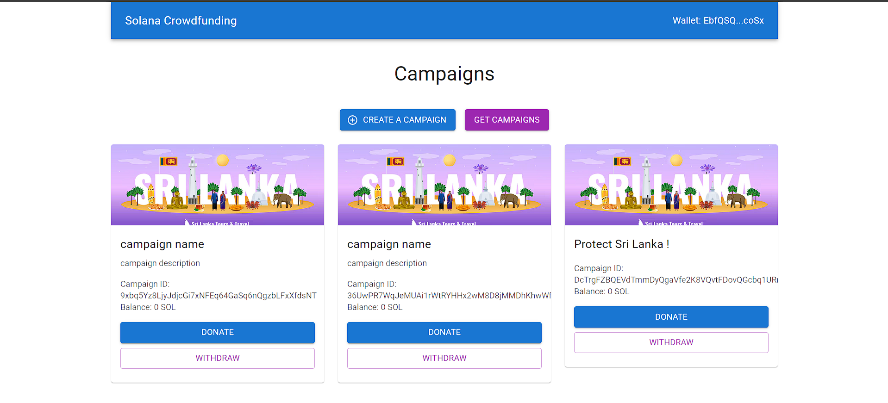

# 💸 Solana Crowdfunding DApp

[](https://github.com/dimanranawaka/solana-crowdfunding-dapp)

<p align="center">
  <a href="https://github.com/dimanranawaka/solana-crowdfunding-dapp/issues">
    
  </a>
  <a href="https://github.com/dimanranawaka/solana-crowdfunding-dapp/network/members">
    
  </a>
  <a href="https://github.com/dimanranawaka/solana-crowdfunding-dapp/stargazers">
    
  </a>
  <a href="https://github.com/dimanranawaka/solana-crowdfunding-dapp/blob/main/LICENSE">
    
  </a>
</p>

---

## 🚀 Project Overview

The **Solana Crowdfunding DApp** is a decentralized application (DApp) built on the Solana blockchain. It enables users to create and manage crowdfunding campaigns, allowing contributors to fund projects securely and transparently. By leveraging the Anchor framework, this DApp ensures efficient development, high performance, and robust security.

### Key Features

- **🎯 Campaign Creation:** Users can initiate campaigns by providing essential details like name, description, target amount, and more.
- **🔒 Secure Fund Management:** The smart contract manages funds automatically, allowing only authorized administrators to withdraw funds.
- **💡 Transparent Tracking:** All contributions, withdrawals, and updates are recorded on the blockchain, providing real-time visibility and enhancing trust.
- **🌐 Global Accessibility:** The platform supports contributors worldwide, eliminating geographical barriers and enabling seamless cross-border transactions.
- **⚡ Cost-Effective Transactions:** Built on Solana, known for its low transaction fees and high throughput, making crowdfunding more accessible and efficient.
- **🛡️ Immutable Records:** Transactional data and campaign details are stored immutably on the blockchain, ensuring transparency and auditability.

---

## 🛠️ Technologies Used

- **Rust:** For writing the core smart contract logic.
- **Anchor Framework:** Simplifies Solana smart contract development.
- **Solana Blockchain:** Provides the underlying decentralized infrastructure.
- **TypeScript:** Used for client-side development and interaction with the blockchain.

---

## 🛠️ Installation

To get started with the Solana Crowdfunding DApp, follow these steps:

1. **Clone the Repository:**

    ```bash
    git clone https://github.com/dimanranawaka/solana-crowdfunding-dapp.git
    cd solana-crowdfunding-dapp
    ```

2. **Install Dependencies:**

   Ensure you have **Node.js**, **Rust**, and **Solana CLI** installed. Then run:

    ```bash
    npm install
    ```

3. **Build and Deploy the Program:**

    ```bash
    anchor build
    anchor deploy
    ```

4. **Run the Application:**

   Use the following commands to interact with the DApp:

    ```bash
    npm start
    ```

---

## 💻 Usage

Once the application is up and running, users can:

1. **Create Campaigns:** Start new crowdfunding campaigns by providing necessary details.
2. **Contribute to Campaigns:** Donate to existing campaigns using SOL tokens.
3. **Withdraw Funds:** Admins can withdraw funds from successful campaigns.

---

## 🤝 Contributing

We welcome contributions to enhance the Solana Crowdfunding DApp! To contribute:

1. **Fork the Repository**
2. **Create a New Branch:** (`git checkout -b feature-branch`)
3. **Make Your Changes** and **Commit Them:** (`git commit -m 'Add new feature'`)
4. **Push to the Branch:** (`git push origin feature-branch`)
5. **Open a Pull Request**

Please ensure your code adheres to our coding guidelines and includes relevant tests.

---

## 📄 License

This project is licensed under the MIT License. See the [LICENSE](./LICENSE) file for details.

---

## 📬 Contact Information

For any inquiries or feedback, please contact:

- **Diman Ranawaka**
- Email: [dimanranawaka@example.com](mailto:dimanranawaka@example.com)
- GitHub: [dimanranawaka](https://github.com/dimanranawaka)

---

<p align="center">
  Made 🧑‍💻🛠️ by <a href="https://github.com/dimanranawaka">Diman Ranawaka</a>
</p>
